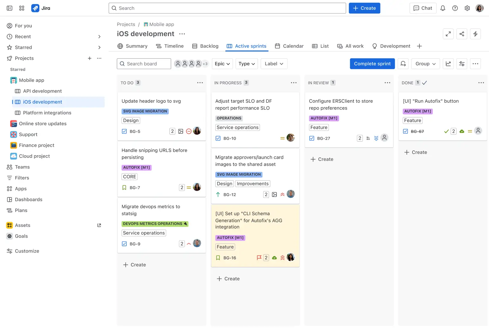

# What is Jira?
Jira is an industry-leading project management tool that brings every team together to plan, track, and deliver any type of project with confidence. It is the single source of truth for your entire organization, empowering teams with the context to move quickly while staying connected to the greater business goal. Whether used to manage everyday tasks or scale complex projects, Jira is where teams and AI come together to drive better outcomes, faster. 
### Who uses Jira?
Jira enables cross-functional teams to work together, including:
- Software teams
- Marketing teams
- Project management teams
- Design teams
- IT teams
- Operations teams  

Jira supports any project management process or methodology your team might need, from agile planning to fully customizable views, including lists, timelines, and Kanban and Scrum boards. Jira gives you the AI-powered tools you need to unlock collaboration, stay aligned, and deliver your best work, together.

### Getting started in Jira
Jira is a project management tool for any team in your organization—from product to marketing and beyond—that needs to plan, organize, and track their work. Jira’s seamless AI and flexible workflows can be customized for your team’s unique needs, meaning teams of all kinds can enjoy increased productivity and visibility as they march toward delivering their best work.
- Create a project
- Pick a template
- Set up your columns
- Create a work item
- Connect your tools
- Invite your team
- Move work forward

## Jira Projects
A project can be defined as a collection of tasks that need to be completed to achieve a certain outcome. In Jira, a project can be thought of as a container used to organize and track those tasks, or work items, across the entire team.

A Jira project is highly configurable and can be easily customized to map around organizational structure, workflow, or level of agile maturity, making it the only tool to fit any team’s unique way of working. Your team can use a Jira project to track and resolve bugs, launch a new feature, and more.

Your projects can be found in the top navigation in the “Projects” drop down.
### Key Elements of a Jira project
- **Work items** – Jira projects are big goals that have been broken down into small, bite-size pieces of work called work items.
- **People** – Jira makes it easy for teams to plan and track work so you can accomplish more together. Invite users to your Jira project to start collaborating. 
- **Workflows** – Jira projects are structured to follow a process, or workflow, to help move a work item from creation through to completion. These workflows can be created to match your team’s unique way of working. 
### Jira project templates
Templates help teams get set up quickly using projects tailored to a specific team (like HR or software) or use case.Templates include pre-configured work types, workflows, and other relevant features. Two of the most popular templates are the kanban and scrum templates.  
- **Kanban template** visualizes your work using a powerful, yet simple board. It’s designed for teams that limit work in progress and focus on a continuous flow of work. The kanban template in Jira helps teams easily design, manage, and improve their workflow while providing transparency as work moves from to-do to done.  
- **Scrum template** empowers teams to breakdown large pieces of work into more manageable pieces. It’s designed for teams that deliver work on a regular cadence or work in short, time boxed periods called sprints. The scrum template also enables teams to organize and prioritize all work on the backlog and board, while staying focused on the big picture via the roadmap.
### Jira project types
Projects in Jira will either be a “team-managed” or “company-managed” project type. The fundamental difference between the two project types is how they are administered – that is, whether the project is managed at the team level or at a company/Jira administrator level.  
- **Team-managed projects** project type is for teams who want simplified configuration and more control over their own working processes and practices in a self-contained space. Team-managed projects are managed by project administrators, meaning that changes can be implemented without requiring the help of a Jira administrator.
    - Essential features : A modern Jira experience for teams who don’t need advanced features.
        - Timeline
        - Only show your project’s work items on your board
        - Single active sprint
        - Essential agile reporting
- **Company-managed projects** project type is for teams who want to work across multiple projects and with multiple teams in a more standardized way. Company-managed projects are managed by Jira administrators who encourage and promote organizational best practices and processes through a shared configuration.
    - Advanced features : All the power and features that Jira is known for.
        - Advanced planning (Premium only)
        - Ability to pull in work items from other projects on your board
        - Ability to run parallel sprints
        - Comprehensive agile reporting

## Jira Boards
Agile board is a tool that helps teams plan, visualize, and manage that work. In Jira, the board displays a selection of work items in columns, with each column representing a step in your team’s workflow for taking work through completion. A board accompanies each Jira project by default and provides the team with a shared view of all work that hasn't started, work that is in progress, and work that is completed.  
  

### How does a board differ from a project in Jira?
A Jira project is the collection of all work items that need to be completed to achieve a particular goal. A Jira board, on the other hand, is the tool used to manage those work items as they move from creation to completion.

Boards are flexible tools that can be used variety of ways depending on the team’s unique way of working. For example:
- Teams that practice scrum use the board to display a prioritized selection of work that the team has committed to complete within a sprint, or time-boxed period. Work items outside of this selection can be found in the backlog.
- Teams that practice kanban use the board as their work management tool for all work items, moving each work item through the columns from creation to completion.
### Boards available in Jira
Jira offers two boards with unique features that make it easy for teams to start practicing agile methodologies and track their work. These boards come pre-configured and ready for use.
- **Scrum Board** – is great for teams that like to work in sprints, or time-boxed periods when a team works to complete a set amount of work.
- **Kanban Board** – is great for teams who’s primary objective is to manage the flow of work.  
### Swimlanes in a Jira board
A swimlane is a horizontal categorization of work in active sprints of a scrum board or on a kanban board. You can use swimlanes to help you better organize tasks of different categories, such as workstreams, users, application areas, and more.
## Jira Work Items
Teams use `work items (formerly known as issues)` to track bugs and individual pieces of work that must be completed. Depending on how your team uses Jira, a work item could represent a project task, a helpdesk ticket, a leave request form, etc. In Jira, work items typically represent individual work items such as big features, user requirements, and software bugs. You can update work items to show work progress or add relevant information such as who is assigned to the work, in-depth description, or attachments.
### Work Types
Jira has different work types that can help you identify, categorize, and distinguish between different types of work. The work types out-of-the-box include:

- **Epic :** Represents a larger body of work. Epics are often represented as a collection of multiple work items.  
***Example:*** Start a lemonade stand.
- **Task :** Represents a task that needs to be done. Tasks are used as ‘catch-alls’ and when the work cannot be accurately represented by the other work types.  
***Example(s):***  Make lemonade. Create sign. Set-up stand.
- **Story :** Represents a requirement expressed from the perspective of the user.  
***Example:*** As a lemonade enthusiast, I’d like to have a really cold, crisp drink.
- **Bug :** Represents a problem that needs to be fixed.  
***Example:*** The lemonade is too sour.
- **Subtask:** Represents a more granular decomposition of the work required to complete a standard work item. A sub-task can be created for all work types.  
***Example:*** Squeeze lemons.
### Jira work item hierarchy
Jira’s work item hierarchy levels showcases how pieces of work ladder up to broader initiatives and represent different levels of detail in a plan’s scope. Jira's built-in work item hierarchy from top to bottom is as follows:
- **Epics -** Epics represent broad objectives or large bodies of work that can be broken down into stories, tasks, and bugs.
- **Work items (task, story, bug) -** Stories and tasks are work items that represent work that needs to be completed in support of those larger goals. Bugs are problems that impede the progress or functionality of work.
- **Sub-tasks -** A granular piece of work required to complete a story, task, or bug.  

## Jira Workflows
In Jira, the path your work items take from creation to completion is called workflow. Each workflow is composed of a set of statuses and transitions that your work item moves through during its lifecycle and typically represents work processes within your organization. 
A Jira workflow represents the process your team uses to take a work item from creation to completion.  

  

Jira workflows are composed of 3 unique elements:

- **Status:** A status indicates where the work item is within the workflow. Some examples may include: Open, In Progress, In Review, Scheduled, Pending, Waiting, etc.
- **Transition:** A transition represents the action being taken to move a work item from status to status. A transition is a one-way link, so if a work item needs to move back and forth between two statuses, two transitions need to be created.
- **Resolution:** When a task is completed and no longer open, it needs a resolution status. Some examples may include: Closed, Resolved, Shipped, Completed, Done, Finalized, Won’t Do, etc. (This is only available in company-managed projects).

## Jira Reports & Dashboards
### Jira Reports
Jira has a range of reports that enable you to visualize trends about your project, versions, epics, sprints, and issues. Reports in Jira can be categorized into 4 types:
- **Agile reports –** Understand your team’s velocity, spot bottlenecks, and better predict future performance
- **DevOps reports –** Understand deployment pipeline and frequency to enable greater collaboration and streamline the product lifecycle
- **Issue analysis reports –** Understand the types of work your team is focused on and how your team is keeping up with the work
- **Forecast and management reports –** Evaluate your team’s capacity and better predict future performance
### Jira dashboards
In Jira, a dashboard is a collection of “gadgets”, or pre-installed data displays, that show various types of real-time information to help you track and monitor your work across projects. Dashboards can be private or shared with other users on your instance. They can also contain information from a single or multiple projects, enabling you to access pertinent information from across your whole instance.