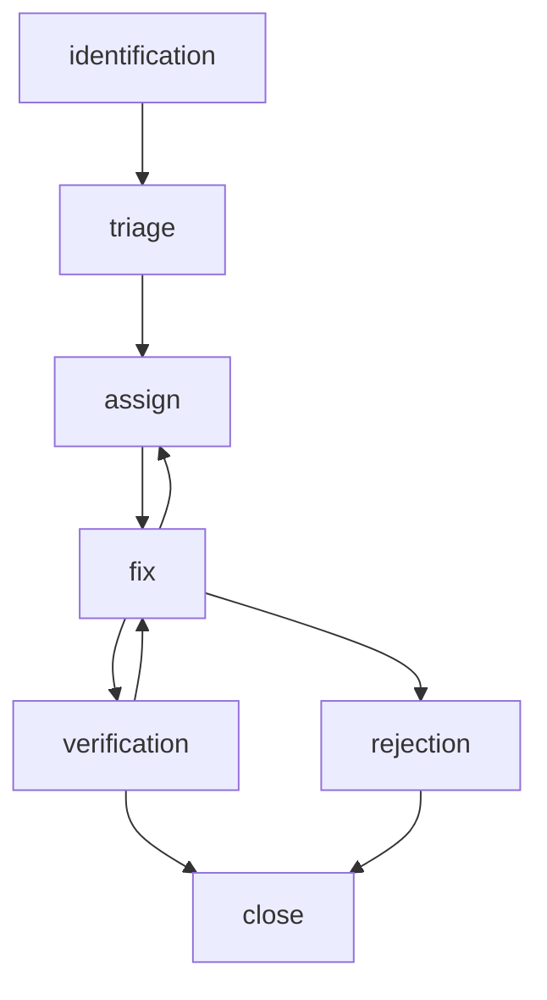

# Test Team Organization Study Guide

## Roles

### Test Manager
The **Test Manager** is responsible for overseeing the entire testing process, ensuring that it aligns with the project’s goals and quality standards. They develop test strategies, manage the testing team, and coordinate with other departments. Additionally, they ensure testing resources are effectively utilized, making sure the testing process is efficient and thorough

### Tester
**Testers** identify defects by executing tests. They ensure that the software functions as expected and meets specified requirements. Their key tasks include writing and executing test cases, reporting bugs, and verifying fixes. Testers often work closely with developers to understand the software and its potential issues, which helps contribute to the overall quality of the product

### Tester/Developer Independence
Quality is the responsibility of everyone involved in the software development process, though the roles we play in maintaining it can vary. Testers typically approach the software with a pessimistic mindset, operating under the belief that “this application has defects, and it is my job to find them.” In contrast, developers often have an optimistic mindset, thinking “this application works, and I need to continue building on top of it.” Despite these differing perspectives, it is crucial to remember that both testers and developers are working towards a common goal: deploying a fully functional and failure-free application to end users. By having independent testers, the testing process becomes more unbiased, improving defect detection and better ensuring the software meets required standards and specifications. This approach not only enhances the overall quality of the software but also builds confidence among stakeholders and end users

### Stakeholder & Business Analysts
**Stakeholders** represent the interests of those who have a stake in the project, such as customers, users, or management. They provide input on requirements and feedback on the software’s performance. Their responsibilities include reviewing test results, providing feedback, and making decisions based on the testing outcomes. Stakeholders ensure that the software meets the needs and expectations of its intended users

**Business Analysts** act as a bridge between the business and technical teams. They usually have a good business understanding and technical knowledge, which helps them to analyze documentation and requests from both the business and technical teams. If there is a misunderstanding between the business and technical teams it is the job of the **Business Analysts** to help clarify and clear the misunderstandings and blockers

## Test Documents

### Test Strategy
A **Test Strategy** is a document that can be used as a company wide guide on best practices when it comes to testing. These practices, whether testing strategies, objectives, processes, etc., are typically universal in nature: they should be applicable across work projects

### Test Plan
The **Test Plan** is a comprehensive document that outlines how a team will manage testing for a product or system, including details such as the objectives, strategies, schedule, estimates, and deliverables of a project. This document serves as a central hub, specifying the need for other documents such as the test case document and the requirements traceability matrix. It is sometimes referred to as a master test plan, level test plan, or test scope. Ultimately, the **Test Plan** is meant to coordinate testing activities effectively, ensuring that all aspects of the testing process are covered and aligned with the overall goals of the project

### Test Schedule
The **Test Schedule** is a document that outlines the timeline for completing various testing activities. It specifies when each part of the software needs to be tested in order to facilitate timely testing. In an Agile development environment, this schedule is a living document, meaning it is continuously updated and adjusted as the project progresses. This flexibility allows the team to adapt to changes and unforeseen challenges, ensuring that testing remains aligned with the overall project timeline. The **Test Schedule** also helps in coordinating efforts across different teams, preventing bottlenecks and ensuring that resources are allocated efficiently. Maintaining a well-structured test schedule can help ensure that all critical aspects of the test objects are tested, which makes it easier to handle unexpected problems when they arise

### Requirements Traceability Matrix
The **Requirements Traceability Matrix** (RTM) is a document that visualizes the relationship between System Requirements/User Stories, acceptance criteria, and the Test Cases that cover those requirements. It can also track any defects revealed after testing. This means the **RTM** maps requirements to their specific test cases, which helps with maintaining traceability and ensuring comprehensive test coverage

### Software Requirements Specification
A **Software Requirements Specification** (SRS) document is a detailed and structured description of the software system to be developed. It serves as a comprehensive guide for both the development team and stakeholders, outlining the **functional** and **non-functional requirements** of the software. The core of the **SRS** is the **functional requirements** section, which specifies the specific behaviors or functions the software must perform. Additionally, the **non-functional requirements** section covers performance, security, usability, and other quality attributes the software must meet. The document also includes external interface requirements, specifying how the software will interact with other systems or hardware, and design constraints, listing any limitations or constraints that affect the design or implementation. An **SRS** is crucial for ensuring clarity and alignment among all stakeholders, providing a blueprint for the development team, and serving as a basis for **validation** to the testing team

### Test Progress Report
The **Test Progress Report** is a document used to track the progress of tests designed and executed, providing a clear overview of testing activities. This report works in conjunction with the Test Schedule by providing detail on the status of the various tests completed and in progress. It includes details such as the number of test cases executed, passed, failed, and any defects identified during the testing process. By maintaining an up-to-date Test Progress Report, teams can monitor their progress, identify any bottlenecks or issues early, and make informed decisions to ensure the quality and reliability of the software

### Test Summary Report
The **Test Summary Report** is a document used to aggregate and display the results of test case executions associated with one or more test objects. Partial reports may be included in a Test Progress Report, but the entirety of the test results should be saved in their own documentation. Typical **Test Summary Reports** are organized by test runs or test cycles: this is a way of distinguishing the results of the test cases between development/testing cycles. **Test Summary Reports** include similar information to a Test Progress Report: test cases executed, status of test cases, and defects identified during testing. **Test Summary Reports** provide a basis for Test Progress Reports. These reports are often generated at different milestones and are compared against exit criteria to determine whether development and testing should progress

## Testing Life Cycle

### Standard Testing Life Cycle

#### Requirement Analysis
At the start of the Software Testing Life Cycle is the Requirement Analysis Phase, in which the test team studies the software requirements to identify what systems must be tested and potentially discuss requirements with stakeholders to understand all details. Requirements may be function or non-functional, and a Requirements Traceability Matrix should be designed at this time

#### Test Planning
During the Test Planning Phase a Testing Manager or senior member will draft the test plan and calculate the level of effort and cost estimates for the project. During this phase the resources, test environment, test limitations and schedules are also determined

#### Test Case Development
The Test Case Development Phase sees the creation of test cases, test scripts and any required test data using the established test plan. These components are then reviewed and refactored as needed to meet the requirements of the product. This phase can be done in parallel with the Test Environment Setup

#### Environment Setup
During the Test Environment Setup, software and hardware conditions, which replicate the conditions of the work product, are created and tested. This phase can be done in parallel with the Test Case Development Phase

#### Test Execution
Developed Test cases are carried out by the testers during the Test Execution Phase. This process consists of test script execution, script maintenance, reporting bugs, retesting, and generating reports

#### Test Cycle Closure
The final phase, Test Cycle Closure, marks the completion of test execution and involves several activities, including a meeting to discuss and analyze the reports and other artifacts and identify successful strategies and takeaway lessons from the test cycle

## Defect Management

### Reporting Defects
A defect is any condition, behavior, or functionality that produces incorrect or unexpected results according to system requirements. We track defects in documentation called the **Defect Report**. This report includes important details such as the priority and severity of the defect, which help in determining the order and urgency of addressing the issues. Additionally, the report contains environment information to specify the context in which the defect was found, and steps to reproduce the defect, which allows for accurate recreation for observation and fixing

### Defect Life Cycle
A simpler example of the **Defect Life Cycle** can be found in [this](https://www.baeldung.com/cs/defect-life-cycle-testing) Baledung article

#### 1. Defect Identification (Discover and Log)
In this initial phase, a defect is identified during various stages of software development, such as during code reviews, testing, or by end-users after deployment. The entry criteria for this phase includes the presence of a software application under development or in production and the occurrence of unexpected behavior or results. Actions taken include documenting the defect with relevant data, including steps to reproduce, screenshots, logs, etc. The exit criteria for this phase is the successful logging of the defect into a defect tracking system with all necessary information

#### 2. Defect Categorization and Prioritization (Triage)
Once a defect is logged, it needs to be categorized based on its severity and impact on the system. The entry criteria for this phase is the availability of a logged defect. Actions include assessing the defect's severity (e.g., critical, major, minor) and its priority (e.g., high, medium, low) based on factors like user impact, frequency, and business importance. The exit criteria is the assignment of a severity and priority level to the defect to help in planning the resolution process

#### 3. Defect Assignment (Assign)
After categorization, the defect is assigned to the appropriate team or individual responsible for fixing it. The entry criteria for this phase is a categorized and prioritized defect. Actions involve the project manager or lead developer reviewing the defect and assigning it to a developer or a team with the necessary expertise. The exit criteria are the successful assignment of the defect to a responsible party along with a tentative timeline for resolution

#### 4. Defect Analysis and Planning (Fix Part 1)
In this phase, the assigned developer or team analyzes the defect to understand its root cause. The entry criteria include an assigned defect. Actions taken involve reviewing the code, reproducing the defect, and identifying the underlying issue. This phase may also involve planning the fix, estimating the effort required, and determining the impact on other parts of the system. The exit criteria are a clear understanding of the defect's cause and a plan for fixing it

#### 5. Defect Fixing (Fix Part 2)
This is the phase where the actual coding work to fix the defect takes place. The entry criteria are a well-understood defect and a plan for fixing it. Actions include modifying the code, performing unit tests, and ensuring that the fix does not introduce new defects. The exit criteria are the completion of the code changes and initial testing to confirm that the defect is resolved

#### 6. Defect Verification (Verify)
Once the defect is fixed, it needs to be verified to ensure that the fix works as intended and does not affect other parts of the system. The entry criteria for this phase is a fixed defect. Actions involve retesting the defect in the same environment where it was originally found, as well as regression testing to ensure no new issues have been introduced. The exit criteria are the successful verification of the defect fix and confirmation that the system is stable

#### 7. Defect Closure (Close)
After verification, the defect is marked as closed. The entry criteria for this phase is a verified defect fix. Actions include updating the defect tracking system to reflect the closure, informing stakeholders, and documenting any lessons learned. The exit criteria are the formal closure of the defect in the tracking system and communication to all relevant parties

#### 8. Defect Reporting and Metrics
The final phase involves reporting on the defect and gathering metrics to improve the development process. The entry criteria is a closed defect. Actions include generating reports on defect trends, root causes, and resolution times. These metrics help in identifying areas for process improvement and preventing future defects. The exit criteria are the availability of comprehensive defect reports and actionable insights for process enhancement

#### Defect State Transition Diagram
The state transition diagram below provides a basic flow chart of a defect life cycle. Note that once a defect is assigned it can be reassigned to someone new: typically this would happen if the assignee can't fix the defect or if someone with better expertise becomes available. In a similar vein, defects can be rejected for various reasons:
- defect can't be reproduced
- defect has been reclassified as a feature
- defect is a duplicate of another defect
- the next round of development is expected to fix the defect

Finally, note that if fixes for the defect do not solve the defect then it needs to move back to the fix state in order to continue work solving the defect

## Agile

### Agile Model
Agile methodologies are flexible and adaptive, allowing for iterative progress and continuous improvement. Any Agile methodology is going to have the four following tenants as core guiding principles:
1. **Individuals and Interactions over Processes and Tools**
   - Agile emphasizes constant communication and strong relationships between the client and developer. The focus is on collaboration and effective communication rather than rigid processes and tools.
2. **Working Software over Comprehensive Documentation**
   - In Agile, the priority is to deliver functional software. If a bug is found, it is fixed immediately, even if it means adjusting the planned features. The goal is to provide working software rather than extensive documentation.
3. **Customer Collaboration over Contract Negotiation**
   - Agile promotes ongoing collaboration with the customer. This allows for changes to be communicated, discussed, and implemented as needed, ensuring the final product meets the customer's needs.
4. **Responding to Change over Following a Plan**
   - Agile values flexibility and the ability to adapt plans based on feedback and changing requirements. This approach enhances customer satisfaction by delivering a product that truly meets their needs.

While Agile is highly effective for many types of software development, it may not be suitable for projects with highly specific and inflexible requirements. In such cases, a more structured approach might be necessary.

### Agile Methodology
Teams that work with an Agile mindset typically have three things in common:
1. Dynamic Project Scopes
2. Iterative Development Cycles
3. Copious use of Automation Tools

There are some common terms used across Agile methodologies:
- **Epic**
    - Epics are terms used to describe related functionality
        - "Users should be able to manage their authentication with our application"
- **User Story**
    - User Stories are easy to understand descriptions of functionality in your application
        - these descriptions should be easy to understand (you don't need technical knowledge to understand them)
    - "as a user I want to log in to the service so I can manage my account"
    - typically your user stories will be organized into multiple epics
- **Story Points**
    - Story Points are arbitrary numbers (as determined by the team) that are assigned to user stories to determine how much time/effort it will take to complete said user story. These numbers are arbitrary because each team will need to decide how to assign story points to user stories
        - for instance, for a login user story, you might assign it three story points due to three potential method calls needed to implement the user story
- **Velocity**
    - velocity is the number of story points handled (completed) during a development cycle. As a team matures and completes more development cycles, the velocity numbers (both those completed and those aimed for) can be referenced to better understand the capabilities of the team, and to help the team story point user stories more accurately in the future
- **Sprint**
    - development cycles (typically a few weeks in length) are called sprints. During a sprint a velocity will be aimed for, and when the sprint is finished the team can check to see if they met their target velocity or not, which further helps them to forecast their capabilities in the future

### Agile Implementation: Scrum
Scrum is an Agile methodology that organizes work in to "backlogs". There are a couple different roles in a Scrum, some for the development team and others to categorize the client:
- **Development Team**
    - this is the team (usually a small group, no more than 10 individuals) that is doing the work
    - there can be multiple teams, not just a dev team (SRE team, IT team, etc)
- **Product Owner**
    - this is the individual or team that handles communication and coordination with the Scrum team
- **Stakeholder**
    - this is the individual or entity your work is for
- **Scrum Master**
    - this is who is leading the scrum team: they handle communicating with the product owner and they also manage communication between the different teams in the scrum
- **Team Members**
    - These are the individuals who compose the various teams in the scrum

### Scrum Terms
The Scrum methodology is divided into three main phases: the **Initial Phase**, **Sprint Cycles**, and the **Closure Phase**. In the **Initial Phase**, the project's starting goals are established, and the initial **Project Backlog** is created. This backlog is a collection of epics and user stories that need to be completed throughout the project. 

During the **Sprint Cycles**, the actual sprints take place. The duration of this phase can be adjusted based on changing requirements and business needs. Each sprint involves a set of user stories that the team aims to complete within a specified time-frame.

The **Closure Phase** marks the end of the project work. In this phase, any remaining tasks are completed, and closing documentation is prepared. The team can then be reassigned to new projects.

Key terms in Scrum include the **Backlogs** and **Ceremonies**. The **Project Backlog** is the complete collection of epics and user stories that need to be finished, while the **Sprint Backlog** consists of the epics and user stories that need to be completed during the current sprint. **Ceremonies**, or activities, in Scrum include **User Story Planning** and the **Daily Scrum** (Stand Up). **User Story Planning** occurs at the start of a sprint, where user stories and epics are assigned to individuals or groups based on their story points. The **Daily Scrum** is a daily team check-in during a sprint, allowing team members to collaborate and realign their efforts.

The final **ceremony** is the **Sprint Retrospective**: this is a time for the team to review their efforts during the sprint. During this time the team reviews what went well, what can be improved upon, and what still needs to be accomplished in upcoming sprints

### Waterfall Model
When starting any project, a crucial question is: can I go back? In some fields, like bridge building or brain surgery, the answer is no. Mistakes can’t simply be undone, so work must be done correctly the first time. This “waterfall” mindset, once common in software development, limits problem-solving approaches.

The Waterfall methodology has clear advantages for projects that have strict requirements. It provides a well-defined end goal, often outlined in a contract, and makes it easy to identify next steps between phases of work. This reduces confusion between teams, as each team has a specific role, eliminating the need for second-guessing. Additionally, no in-depth knowledge of specific “ceremonies” or mindsets is required; once step A is completed, you move on to step B, then C, and so on.

However, there are drawbacks. If a client agrees to terms but later changes their mind about the features, they are stuck. Developers also can’t revise the project with the client to better meet their needs. The inability to move backward creates pressure to get everything right the first time, which can be problematic if teams work in isolation and don’t understand how their pieces fit together. Debugging is challenging until the entire project is finished, and any bugs discovered during development must be worked around as opposed to going back and fixing them before continuing work

### V-Model
The V-shaped model is a structured approach to software development similar to the waterfall methodology that emphasizes validation and verification. It begins with defining clear requirements, followed by design and implementation. Each stage is thoroughly validated to minimize errors and ensure the software meets customer needs. Unlike Agile, it’s a sequential process: The model’s “V” shape represents the development lifecycle, with validation on the left side and verification on the right. It ensures that requirements align with user needs and that the final product aligns with those requirements
